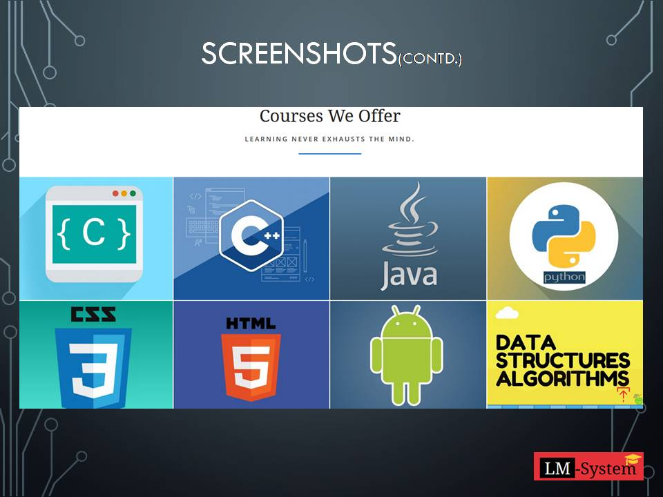

**Learning Management System**

- Learning Management System is an application.
- It can be web-based or an independent application.
- The internet and worldwide web have provided us an easy access to information and knowledge.
- It supports teaching and learning using a computer-web technology.

**Objective**

------------

- Learner-centered
- Teaching & Learning
- More interactivity
- Helpful in bridging gap between a teacher and student
- Easy and quick access to various courses and contents

**Screenshots**

------------

 

 

 

 

 

 

 

 

 

 

 

 

 

 

 

 

 

 

 

 

 

